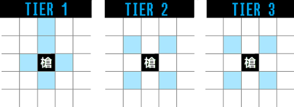
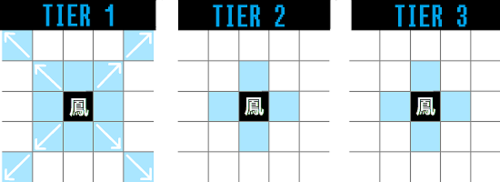

Gungi Ruleset
=============

What is Gungi?
--------------
Gungi is a fictitious strategy board game from the manga/anime
HunterXHunter. The writer never specified rules for Gungi, but Japanese
fans have created rules to make the game actually playable. I've
acquired the rules as translated by an English speaking fan. For the
purposes of stickpage playing Gungi, I have changed very few rules, but
I have renamed a few pieces and rules  for more consistency, ease of
understanding and to clarify the previously vague rules or to ease
unnecessary ruling.

The Basics
----------
Gungi is played by two players, like traditional chess. One player
controls black pieces and one player controls white pieces. The goal
of the game is to move, drop and position your pieces to capture the
opposing colors commander. Should either commander be at risk of being
captured, this is called check. Should a commander be incapable of
escaping being in check, this is called checkmate and means the end of
the game. Just like the king in chess. Players will take turns dropping
or moving pieces. Black goes first.

Towers
------
There is a third dimension above the board called tiers, tiers range
from one to three. Allowing pieces to be stacked atop one another in
these tiers, stacked pieces are called towers and stacking pieces is
called towering.
* Towers cannot contain two allied pieces of the same name.
* Only pieces on the top-most tier of a tower are able to move.
Any piece(s) below are rendered immobile until the piece(s) above them
have been removed

Initial placement
-----------------
Each player starts the game with 23 front pieces in their hand and no
back pieces. Starting with black, players will take turns placing
pieces in their territory "The first three rows on their sides of the
board" until both players have placed all of their starting pieces.

During the initial placement, both players must have a soldier placed
on each column. Since you start the game with nine soldiers that means
there will only be one soldier of yours in each column.
The Fortress and Catapult must be placed on the first tier. The Commander
must be placed on the highest avaialable tier on the chosen (rows, cols). 
The other pieces are free to stack freely in any order.

Dropping
--------
After the initial placement you may drop any pieces that are added to
your hand during the game on any unoccupied square on the board.
However, you can drop allied pieces directly onto the Catapult,
Fortress, Ninja, and Jounin.

Movement and Attacking
----------------------
Moving or attacking take a turn.
A tier one unit cannot move over enemy units except for the Ninja,
Archer and Jounin. Tier two and three units can move over enemy units.

# There are two types of attacking, mobile and immobile.

1. Mobile attack: You attack an enemy piece within your piece’s range,
occupy its position, and add the enemy piece to your hand. When
attacking another tower with a mobile strike, you can only attack the
top-most tier, no matter how high your own tower may be. This means
that when you attack a tower, you replace the top-most tier.

2. Immobile attacks: Only used when moving within the same tower. You
attack the piece above or below your piece in a tower and add it to
your hand. If the piece was on top, you simply capture it. If the piece
was below, the pieces above it descend to a lower tier.
You cannot attack a piece that is two tiers above or below your piece.

The Board
---------
Gungi is played on a nine by nine board. When you drop or move a piece,
you will call out the pieces name and state which square it is being
dropped on or moved to.
Example: I'm moving Ninja to e5.

While the Gungi board is only nine by nine, there is a third dimension
above the board for tiers. Essentially making Gungi nine by nine by
three. It's important to call out when a piece is moving or being
dropped into this dimension.
Example: I'm moving Ninja to h7, tier two.

Pieces that are on the board are called active pieces, while captured
pieces are taken from the board are flipped and added to your hand.

The Horizontal axis is referred to as rows and the vertical axis is
referred to as columns. Remember, left to right, rows. Front to back,
columns.

The Pieces
----------
Each piece will have its name in the center to represent it, so you
can understand the pieces role and movement. Each piece has a front
and a back, when you capture a piece you will flip it and add it to
your hand, from front to back and vise versa, that piece becomes your
color when you capture it. Except for the commander which has no back
and once captured means defeat for that player.
Example: Black Archer becomes White Arrow when captured and White Archer becomes Black Arrow when captured.

Subsequently if you capture an enemy back piece, it becomes your front
piece and you add it to your hand.
Example: Black Arrow becomes White Archer and White Arrow becomes Black Archer.

Each player will start the game with Twenty Three pieces in their hand.
List of Pieces:
Front, Back and amount.
* Commander has no back piece. x1
* Captain and Pistol x2
* Samurai and Pike x2
* Ninja and Jounin x3
* Catapult and Lance x1
* Fortress and Lance x1
* Hidden Dragon and Dragon King x1
* Prodigy and Phoenix x1
* Archer and Arrow x2
* Soldier and Bronze x7
* Soldier and Silver x1
* Soldier and Gold x1

Front Pieces
------------
### Commander

* Cannot move into check.
* Cannot tower to escape check.
* Must be the top of any occupied tower.
* Cannot receive the Mobile Range Expansion Effect.
* Cannot be added to hand.

### Captain

* May exchange its tier one position with an allied tier three pieces
position, except for the commander. This takes a turn.
* May exchange its tier three position with an allied tier one pieces
position, except for fortress and catapult. This takes a turn.

### Samurai

* May exchange position with an allied commander that is on space in
front, back, left or right of the samurai. Only if the samurai is tier
one. This takes a turn.

### Ninja

* Can jump over enemy pieces.
* Should ninja move into a position where it will be unable to move
next turn, before taking an enemy piece, you may add it back to your
hand. If you've taken a piece that turn you must wait until next turn.
This doesn't take a turn.
* You may drop back pieces atop an allied tier one ninja. This takes a
turn.

### Catapult

* Cannot move or attack.
* Must be placed within your territory.
* You may drop pieces atop an allied tier one catapult.
* Grants mobile range expansion to allied units.

### Catapult Expansion Range

* These images represent a catapult placed within your territory "the 
first three rows on your side of the board". Allied units within the
orange squares receive mobile range expansion. Meaning that they
receive attack ranges as though they are a tier higher than their
current tier, to a maximum of tier three. Unless the unit does not
receive mobile range expansion. Pieces towered with the catapult also
receive mobile range expansion.

### Fortress

* Cannot move or attack.
* Must be placed within your territory.
* You may drop pieces atop an allied tier one fortress.
* Grants mobile range expansion to allied units.

### Fortress Expansion Range

* All allied pieces occupying squares directly in front of fortress all
the way to the other side of the board, receive mobile range expansion.
Meaning that they receive attack ranges as though they are a tier
higher than their current tier, to a maximum of tier three. Unless the
unit does not receive mobile range expansion. Pieces towered with the
fortress also receive mobile range expansion.

### Hidden Dragon

* Tier one may move any length of squares to the front, back, left or
right.
* Does not receive mobile range expansion.

### Prodigy

* Tier one may move any length of squares diagonally.
* Does not receive mobile range expansion.

### Archer

* Archers can jump over enemy pieces.

### Soldier

* You cannot drop a soldier into a column already occupied by an allied
soldier. You can however move soldiers into a column occupied by allied
soldiers.
* You cannot drop a soldier to directly place a commander in checkmate.
* Should soldier move into a position where it will be unable to move
next turn, before taking an enemy piece, you may add it back to your
hand. If you've taken a piece that turn you must wait until next turn.
This doesn't take a turn.
* Following the initial arrangement there must be an allied soldier in
every column.

Back Pieces
-----------

### Pistol

* No special effects.

### Pike

* No special effects.

### Jounin

* Can jump over enemy pieces.
* You may drop front pieces atop an allied tier one Jounin.
This takes a turn.

### Lance

* May move any amount of squares directly in front.
* If you capture a Lance, you flip it to its respective catapult or
fortress and immediately place it within your territory, before you
end your turn.
* Should Lance move into or be in a position where it will be unable to
move next turn, before taking an enemy piece, you may add it back to
your hand. If you've taken a piece that turn you must wait until next
turn. This doesn't take a turn.

### Dragon King

* Tier one may move any length of squares to the front, back, left or right.
* Does not receive mobile range expansion.

### Phoenix

* Tier one may move any length of squares diagonally.
* Does not receive mobile range expansion.

### Arrow

* No special effects.

### Bronze

* You cannot have two allied Bronze units in the same column.
* You cannot get checkmate with Bronze, though bronze may assist in
checkmate.
* If bronze captures the top tier of a tower, all enemy pieces within
the tower flip and align with bronze, becoming bronzes allies.

### Silver

* No special effects.

### Gold

* No special effects.
